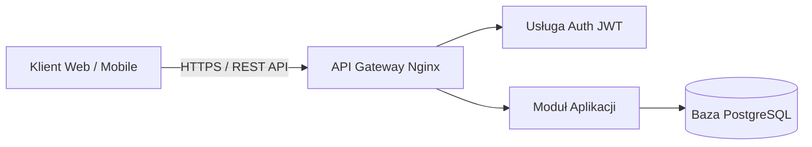

# Podręcznik Inżynierski: Dokumentacja Techniczna, Markdown, User Stories i AI
## Vademecum Praktyczne dla Technikum Programistycznego i Informatycznego
**Autor:** Przemysław Żarnecki • Standard INFOTECH / DevOps & Software Engineering

---

## 1. Dlaczego kod bez dokumentacji jest bezużyteczny?
W branży IT funkcjonuje powiedzenie: *"Kod mówi komputerowi JAK ma działać, ale tylko dokumentacja wyjaśnia ludziom DLACZEGO i PO CO powstał"*. Nawet najbardziej wyrafinowany algorytm napisany w C++, Rust czy Pythonie trafi do kosza, jeśli żaden inny programista w zespole nie potrafi go uruchomić, skonfigurować ani zintegrować z API.

Jako przyszły technik programista lub administrator musisz opanować dwa środowiska tworzenia dokumentacji:
1. **Biznesowe (Współpraca z klientem i analitykami):** Narzędzia chmurowe (Google Docs, Office 365) oparte o śledzenie zmian, komentarze i zatwierdzanie wersji.
2. **Inżynierskie (Współpraca z developerami i DevOps):** Paradygmat **Docs-as-Code** oparty na języku **Markdown** i systemie kontroli wersji **Git**.

---

## 2. Paradygmat Docs-as-Code i GitHub Flavored Markdown (GFM)

### 2.1. Czym jest Docs-as-Code?
Zamiast tworzyć ciężkie, binarne pliki `.docx` i przesyłać je mailem, traktujemy dokumentację dokładnie tak samo jak kod źródłowy:
* Piszemy w edytorze kodu (VS Code, Vim) w czystym tekście (`.md`).
* Trzymamy pliki w tym samym repozytorium co kod (`/docs/`, `README.md`, `CONTRIBUTING.md`).
* Każda zmiana jest rejestrowana w commitach, podlega diffom (`git diff`) i recenzji w **Pull Requestach (PR)**.
* Zmiany w dokumentacji są automatycznie budowane i wdrażane przez potoki CI/CD (np. GitHub Pages, MkDocs, Docusaurus).

### 2.2. Zaawansowane elementy składni Markdown (GFM)

#### Nagłówki i struktura logiczna:
```markdown
# H1 - Nazwa Aplikacji / Biblioteki
## H2 - Główny moduł (np. Architektura, API)
### H3 - Szczegółowy endpoint lub podrozdział
```

#### Bloki kodu z podświetlaniem składni (Syntax Highlighting):
Zawsze podawaj identyfikator języka po otwierających trzech grawisach:
````markdown
```bash
# Instalacja zależności i start serwera deweloperskiego
git clone https://github.com/twoj-login/projekt.git
cd projekt
npm install
npm run dev -- --port 8080
```
````

````markdown
```json
{
  "status": "success",
  "data": {
    "userId": "usr_98a72b",
    "role": "administrator",
    "lastLogin": "2026-10-15T08:30:00Z"
  }
}
```
````

#### Tabele Markdown z wyrównaniem kolumn:
Dwukropki w wierszu separatora definiują justowanie:
```markdown
| Zmienna ENV | Typ | Domyślna wartość | Opis |
| :--- | :---: | :---: | ---: |
| `DB_PORT` | Integer | `5432` | Port bazy danych PostgreSQL |
| `JWT_SECRET` | String | *Wymagane* | Klucz szyfrowania tokenów auth |
| `RATE_LIMIT` | Integer | `100` | Maks. liczba zapytań / minutę |
```
* `:---` = wyrównanie do lewej,
* `:---:` = wyśrodkowanie,
* `---:` = wyrównanie do prawej.

#### Checklisty zadań (Task Lists):
```markdown
- [x] Zaprojektowanie schematu bazy danych (PostgreSQL)
- [x] Implementacja endpointu autoryzacji JWT (`POST /api/v1/auth/login`)
- [ ] Pokrycie testami jednostkowymi (min. 80% coverage)
- [ ] Przygotowanie obrazu kontenera Docker
```

#### Diagramy architektury Mermaid (bezpośrednio w Markdown):
Wiele platform (GitHub, GitLab, Notion) renderuje diagramy bezpośrednio ze składni tekstowej Mermaid:
````markdown

````

---

## 3. Anatomia Produkcyjnego Pliku README.md
Plik `README.md` to pierwsza rzecz, którą widzi rekruter, inny deweloper lub potencjalny klient przeglądający Twoje repozytorium na GitHubie.

### Wzorzec struktury produkcyjnej:
1. **Nagłówek i Badges (Tarcze):**
   * Linki z serwisu Shields.io pokazujące wersję, status testów CI/CD, licencję:
     ```markdown
     # 🛡️ SecureVault CLI
     
     
     
     ```
2. **Elevator Pitch (Jednozdaniowy opis problemu):**
   * *Lekkie narzędzie wiersza poleceń do szyfrowania i bezpiecznej synchronizacji zmiennych środowiskowych w rozproszonych zespołach deweloperskich.*
3. **Kluczowe funkcjonalności (Bullet points):**
   * Szyfrowanie end-to-end AES-256-GCM,
   * Zero zewnętrznych zależności runtime,
   * Integracja z potokami GitHub Actions i GitLab CI.
4. **Wymagania wstępne (Prerequisites):**
   * Python `>= 3.11` lub Docker `>= 24.0`.
5. **Instrukcja uruchomienia (Quickstart):**
   * Dokładne, działające komendy do skopiowania do terminala.
6. **Tabela Konfiguracji Środowiskowej (`.env`):**
   * Wykaz wszystkich zmiennych z opisem ich wpływu na bezpieczeństwo i działanie aplikacji.
7. **Przykłady użycia (Code Snippets / CLI):**
   * Jak wywołać program i jaki jest oczekiwany wynik.
8. **Licencja:**
   * Wskazanie licencji (np. MIT, Apache 2.0) i odnośnik do pliku `LICENSE`.

---

## 4. Inżynieria Wymagań: Zwinne User Stories i BDD

### 4.1. Czym jest User Story (Historyjka Użytkownika)?
W metodykach zwinnych (Scrum, Kanban) nie piszemy 300-stronicowych specyfikacji, które dezaktualizują się po miesiącu. Wymagania opisujemy w ujęciu **User Stories** – z perspektywy człowieka, który będzie z systemu korzystał.

#### Oficjalny szablon:
> **Jako** [konkretny typ użytkownika / rola w systemie],  
> **Chcę** [wykonać określoną czynność / mieć dostęp do funkcji],  
> **Aby** [osiągnąć konkretną, mierzalną korzyść biznesową].

### 4.2. Kryteria Akceptacji (Acceptance Criteria - Standard BDD / Gherkin)
Samo User Story to za mało dla programisty i testera. Potrzebne są **Kryteria Akceptacji**, które definiują, kiedy zadanie uznaje się za ukończone (*Definition of Done*). Najbardziej profesjonalnym formatem jest składnia **Given-When-Then** (BDD - Behavior-Driven Development):

* **Zakładając, że (Given):** Stan początkowy systemu i użytkownika.
* **Kiedy (When):** Akcja podjęta przez użytkownika lub zdarzenie zewnętrzne.
* **Wtedy (Then):** Oczekiwany, jednoznaczny rezultat w systemie.

#### Przykład Inżynierski:
* **User Story:**  
  *Jako administrator sieci szkolnej, chcę generować tymczasowe kody dostępu Wi-Fi dla gości z limitem 2 godzin, aby zapewnić im dostęp do internetu bez konieczności udostępniania hasła głównego sieci.*
* **Kryteria Akceptacji (Given-When-Then):**
  * *Kryterium 1 (Sukces):*  
    **Given:** Administrator jest zalogowany w panelu `/admin/wifi` i kliknie przycisk "Generuj kod gościa".  
    **When:** System wygeneruje 6-cyfrowy kod PIN i zapisze znacznik czasu (timestamp).  
    **Then:** Kod jest ważny dokładnie przez 120 minut od pierwszego powiązania z adresem MAC urządzenia gościa.
  * *Kryterium 2 (Wygaszenie sesji):*  
    **Given:** Gość jest połączony z siecią przez 121 minut.  
    **When:** Pakiet danych z urządzenia gościa trafia do routera.  
    **Then:** Router odrzuca pakiet, wymusza rozłączenie sesji i przekierowuje na captive portal z informacją o wygaśnięciu kodu.

---

## 5. Praca Zespołowa: Code Review Dokumentacji i Audyt

### 5.1. Pull Request Review dla plików Markdown
Gdy zmieniasz dokumentację w projekcie komercyjnym:
1. Tworzysz gałąź: `git checkout -b docs/update-readme-api`.
2. Edytujesz plik `README.md`.
3. Robisz commit i push: `git commit -m "docs: update API authentication endpoints" && git push`.
4. Otwierasz **Pull Request (PR)** na GitHubie.
5. Inny programista w zespole sprawdza `git diff` linijka po linijce, dodaje uwagi (*Inline comments*) i klika **Approve** lub **Request Changes**.

### 5.2. Google Docs dla Specyfikacji Biznesowych
Gdy pracujesz z klientem biznesowym (który nie zna gita i terminala):
* Udostępniasz dokument w **Trybie Sugerowania**.
* Klient zaznacza fragmenty i dodaje pytania w komentarzach.
* Po zakończeniu dyskusji tworzycie nazwaną wersję w **Historii wersji** (np. `Specyfikacja_v1.0_Zaakceptowana_przez_Klienta`).

---

## 6. Warsztat AI: Google NotebookLM dla Inżyniera Oprogramowania

### 6.1. Wykorzystanie w Inżynierii Wymagań i Badaniu Kodu
Podczas gdy ChatGPT często halucynuje składnię nieistniejących bibliotek, **Google NotebookLM** doskonale sprawdza się jako:
1. **Analizator dokumentacji zewnętrznych API:** Wgrywasz specyfikację OpenAPI/Swagger w JSON/YAML lub dokumentację SDK w PDF.
2. **Audytor zgodności z RFC i normami:** Wgrywasz normę ISO 27001 lub specyfikację OAuth 2.0 (RFC 6749) i pytasz: *„Jakie nagłówki HTTP są bezwzględnie wymagane przy unieważnianiu tokena odświeżającego?”*.
3. **Generator pytań testowych i brzegowych:** Pytasz: *„Na podstawie wgranych User Stories, wskaż 3 scenariusze brzegowe (edge cases), o których deweloperzy mogli zapomnieć”*.

### 6.2. Zasada Uziemionych Cytowań (Grounding)
NotebookLM przy każdej tezie wstawia znacznik `[1]`. Kliknięcie w znacznik podświetla oryginalny wiersz w pliku źródłowym. Oznacza to, że:
* Nie marnujesz czasu na sprawdzanie, czy AI zmyśliło nazwę metody lub kod błędu HTTP.
* Masz natychmiastowy dowód w dokumentacji źródłowej na wypadek dyskusji z klientem lub zespołem QA (testerami).
